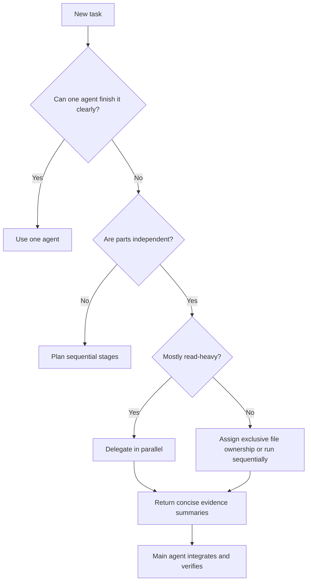

# Codex How To

An engineering-first guide to OpenAI Codex—from your first safe task to
reusable skills, specialized agents, and disciplined multi-agent workflows.

[](https://github.com/Phelan164/codex-howto/actions/workflows/validate.yml)
[](LICENSE)

[Start learning](modules/00-mental-model/README.md) ·
[Choose a track](LEARNING-ROADMAP.md) ·
[Browse skills](#engineering-skill-catalog) ·
[Try the playground](labs/engineering-playground/README.md) ·
[Use the quick reference](QUICK_REFERENCE.md)

> **Status:** community preview. Content was checked against official Codex
> documentation on 2026-07-24. Codex changes quickly; verify settings and
> commands through the links marked **Official source**.

## Why this repository exists

Official documentation is the source of truth for product behavior. This
repository turns that product surface into a practical, runnable curriculum for
software engineers.

You will learn how to:

- give Codex enough context without flooding the conversation;
- encode repository conventions in `AGENTS.md`;
- turn repeated frontend, backend, DevOps, testing, review, and security work into skills;
- connect external systems through MCP;
- choose safe sandbox and approval settings;
- delegate bounded work to specialized agents;
- orchestrate parallel work without creating edit conflicts;
- reduce wasted context, retries, and unnecessary token use;
- automate stable workflows only after they are reliable interactively.

## What is included

- **13 progressive modules** covering safety, prompting, `AGENTS.md`, skills,
  MCP, subagents, orchestration, context efficiency, automation, and
  troubleshooting.
- **7 installable engineering skills** for frontend, backend, DevOps, testing,
  code review, security review, and orchestration.
- **Copy-ready examples** for project configuration, custom agents, prompts,
  hooks, MCP, and local plugins.
- **A dependency-free playground** with seeded defects for practicing the full
  implement–test–review loop safely.

## Who this is for

- **Beginners** who can open Codex but are unsure how to structure a real task.
- **Working engineers** who want repeatable workflows for production repositories.
- **Tech leads** who want shared agent instructions and review standards.
- **Platform teams** building skills, plugins, MCP integrations, and CI automation.

## Choose your route

| Goal | Start here |
|---|---|
| Learn safe Codex fundamentals | [Track A · Safe beginner](LEARNING-ROADMAP.md#track-a-safe-beginner) |
| Build and review application code | [Track B · Application engineer](LEARNING-ROADMAP.md#track-b-application-engineer) |
| Work with delivery and infrastructure | [Track C · Platform and DevOps engineer](LEARNING-ROADMAP.md#track-c-platform-and-devops-engineer) |
| Coordinate subagents efficiently | [Track D · Agent orchestrator](LEARNING-ROADMAP.md#track-d-agent-orchestrator) |
| Learn by fixing a small project | [Engineering playground](labs/engineering-playground/README.md) |

## Learning path

| Stage | Module | Outcome | Time |
|---|---|---|---:|
| Foundation | [00 · Mental model](modules/00-mental-model/README.md) | Choose the right Codex surface and task shape | 25 min |
| Foundation | [01 · Sandbox and approvals](modules/01-sandbox-and-approvals/README.md) | Set safe autonomy boundaries before the first write | 45 min |
| Foundation | [02 · CLI and surfaces](modules/02-cli-and-surfaces/README.md) | Install, authenticate, navigate, and inspect safely | 35 min |
| Foundation | [03 · Prompts and plans](modules/03-prompts-and-plans/README.md) | Write scoped prompts with observable completion criteria | 40 min |
| Foundation | [04 · AGENTS.md](modules/04-agents-md/README.md) | Make repository guidance durable and local | 45 min |
| Engineering | [05 · Engineering skills](modules/05-engineering-skills/README.md) | Build and install reusable engineering workflows | 60 min |
| Engineering | [06 · MCP and tools](modules/06-mcp-and-tools/README.md) | Add live data and actions without bloating instructions | 45 min |
| Engineering | [07 · Testing and review](modules/07-testing-and-review/README.md) | Close the implementation–verification–review loop | 55 min |
| Scale | [08 · Subagents](modules/08-subagents/README.md) | Delegate narrow, independent work | 50 min |
| Scale | [09 · Orchestration](modules/09-orchestration/README.md) | Coordinate parallel agents with clear ownership | 70 min |
| Scale | [10 · Context and token efficiency](modules/10-context-and-token-efficiency/README.md) | Reduce context pollution and expensive retries | 50 min |
| Scale | [11 · Automation, plugins, and hooks](modules/11-automation-plugins-hooks/README.md) | Package and automate stable workflows | 60 min |
| Operations | [12 · Troubleshooting](modules/12-troubleshooting/README.md) | Diagnose failures by layer instead of guessing | 35 min |

Full path: roughly **9–10 hours**. Start with modules 00–03, then follow the
shortest track that matches your work.

## Five-minute start

1. Install Codex using the [official quickstart](https://developers.openai.com/codex/quickstart).
2. Open a small, version-controlled repository.
3. Ask Codex:

   ```text
   Goal: explain how this repository is built and tested.
   Context: inspect the root configuration and contributor docs.
   Constraints: read only; do not install dependencies or change files.
   Done when: return the exact build, test, lint, and type-check commands,
   and cite the files that define them.
   ```

4. Review the result.
5. Generate a starter `AGENTS.md` with `/init`, then replace generic text with verified commands.

## Engineering skill catalog

This repository includes installable starter skills:

| Skill | Purpose |
|---|---|
| [`build-frontend`](skills/build-frontend/SKILL.md) | Implement accessible UI changes with visual and behavioral verification |
| [`build-backend`](skills/build-backend/SKILL.md) | Change APIs, services, persistence, and contracts safely |
| [`operate-devops`](skills/operate-devops/SKILL.md) | Modify delivery and infrastructure with rollback-aware validation |
| [`review-code`](skills/review-code/SKILL.md) | Find consequential defects, regressions, and missing tests |
| [`test-software`](skills/test-software/SKILL.md) | Design risk-based tests and implement the highest-value coverage |
| [`review-security`](skills/review-security/SKILL.md) | Trace trust boundaries and report exploitable security risks |
| [`orchestrate-engineering`](skills/orchestrate-engineering/SKILL.md) | Coordinate bounded agents while protecting context and avoiding edit conflicts |

Copy a skill into `.agents/skills/` for one project or `~/.agents/skills/` for
personal reuse:

```bash
mkdir -p .agents/skills
cp -R /path/to/codex-howto/skills/review-code .agents/skills/
```

Inspect every skill before installing it, then start a new Codex task and invoke
it explicitly:

```text
$review-code Review this branch against main. Lead with consequential findings
and list checks you could not run.
```

## The orchestration rule

Use one agent by default. Add agents only when the work has independent, bounded parts.



Parallel agents often improve elapsed time and protect the main thread from noisy logs, but they normally use **more total tokens**. The efficiency target is fewer failed loops and cleaner context, not the maximum number of agents.

## Repository map

```text
codex-howto/
├── .github/                 # Validation workflow and PR template
├── modules/                 # Progressive tutorials and labs
├── skills/                  # Installable engineering skills
├── labs/
│   └── engineering-playground/ # Self-contained practice project
├── examples/
│   ├── agents/              # Project-scoped custom agent definitions
│   ├── config/              # Conservative Codex configuration
│   ├── prompts/             # Copy-ready task and orchestration prompts
│   └── AGENTS.md            # Starter repository guidance
├── resources/               # Checklists and comparison material
└── scripts/validate_repo.py # Offline structural validation
```

See [CATALOG.md](CATALOG.md) for the complete index and [LEARNING-ROADMAP.md](LEARNING-ROADMAP.md) for suggested tracks.

For a dependency-free end-to-end exercise, copy the
[engineering playground](labs/engineering-playground/README.md) to a disposable
directory and practice backend, frontend, DevOps, testing, review, security, and
orchestration workflows against its seeded defects.

## Source policy

- Product behavior and configuration claims must link to official OpenAI documentation.
- Community examples must be labeled as community material.
- Version-sensitive examples should include a verification date.
- Secrets, production credentials, and destructive defaults are never included.
- Marketing claims such as “10x productivity” are intentionally avoided.

## Inspiration and related work

The progressive-module idea was inspired by [luongnv89/claude-howto](https://github.com/luongnv89/claude-howto). This repository is an original Codex-focused curriculum and does not copy its tutorial text or templates.

Useful related community projects:

- [freestylefly/CodexGuide](https://github.com/freestylefly/CodexGuide)
- [geekjourneyx/awesome-codex-guide](https://github.com/geekjourneyx/awesome-codex-guide)
- [bozhouDev/codex-orange-book](https://github.com/bozhouDev/codex-orange-book)
- [RoggeOhta/awesome-codex-cli](https://github.com/RoggeOhta/awesome-codex-cli)
- [ComposioHQ/awesome-codex-skills](https://github.com/ComposioHQ/awesome-codex-skills)
- [VoltAgent/awesome-codex-subagents](https://github.com/VoltAgent/awesome-codex-subagents)

The authoritative upstream implementation is [openai/codex](https://github.com/openai/codex).

## Contributing

Contributions are welcome. Start with [CONTRIBUTING.md](CONTRIBUTING.md). New
tutorials should include a concrete outcome, a safe exercise, a verification
step, and official sources.

## License and trademarks

Released under the [MIT License](LICENSE). “OpenAI” and “Codex” are trademarks
of their respective owners. This is an independent community project and is not
endorsed by OpenAI or Anthropic.
