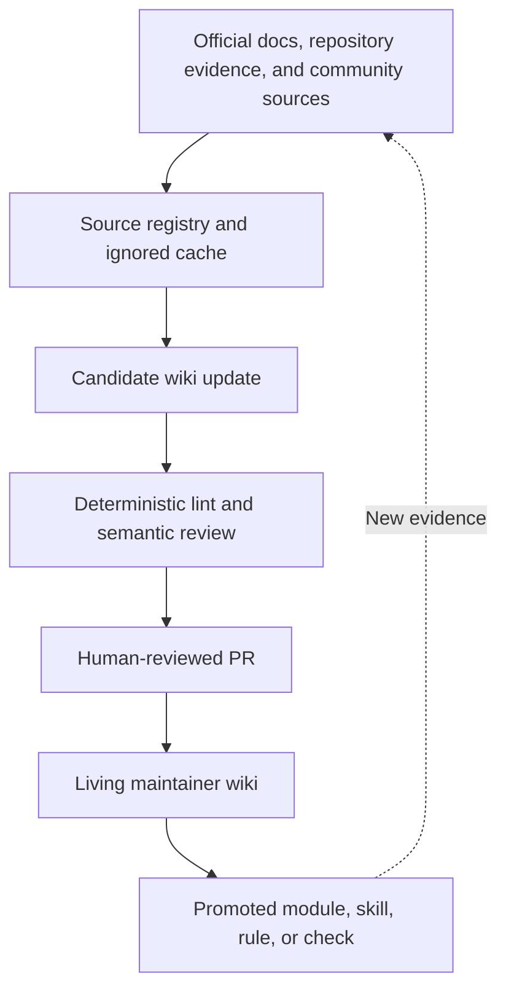

# 13 · Living Codex wiki

## Outcome

Build a review-first knowledge layer that compounds Codex know-how without
turning generated summaries into unreviewed truth.

## The pattern

Most document retrieval starts from raw files again for every question. An LLM
wiki compiles repeated synthesis into durable, interlinked Markdown pages:



This repository adapts
[Karpathy's LLM Wiki pattern](https://gist.github.com/karpathy/442a6bf555914893e9891c11519de94f)
for engineering guidance:

1. **Sources** preserve provenance.
2. **Wiki pages** compile current understanding, conflict, and uncertainty.
3. **The maintenance skill** defines query, ingest, lint, and promotion.

## Keep the surfaces separate

| Surface | Put this there |
|---|---|
| Prompt | One task's goal, context, constraints, and done conditions |
| `AGENTS.md` | Required repository rules and verification commands |
| Skill | A reusable procedure with a clear evidence contract |
| Living wiki | Synthesized evidence, decisions, experiments, and uncertainty |
| MCP | Live external data or actions |
| Automation | A stable recurring workflow with bounded permissions |

Codex memories can help with personal recall, but required team knowledge
belongs in versioned repository artifacts.

## Review-first architecture

The committed [`knowledge/`](../../knowledge/README.md) directory contains:

- a machine-readable source registry;
- a small index that routes Codex before broad search;
- topic, decision, and experiment pages;
- an operation log; and
- no copied external corpus.

Temporary downloads belong in `.wiki-cache/`, which Git ignores. This protects
repository size, copyright boundaries, and secrets while keeping provenance
reviewable.

The implementation deliberately starts without a database, vector search,
MCP server, or web UI. Add those only when retrieval measurements show that
index-first Markdown search is no longer sufficient.

## Six operations

### Query

Read the index, search candidate pages and synonyms, then answer with wiki
links. Query is read-only unless the user asks to save or change knowledge.

### Capture

Preserve an explicit, durable engineering lesson from a merged change,
incident, review finding, or measured run. Use repository artifacts as
evidence, update the smallest relevant page, and accept "no material change"
when the result is too narrow or transient.

### Ingest

Register one source, classify its authority, update every materially affected
page, preserve disagreements, update the index and log, and prepare a PR.
Compile sources sequentially because the registry, index, and log are shared.

### Archive

Save a useful query result only when the user asks. Mark it experimental,
preserve its source IDs, and link existing pages instead of copying them.
Archived synthesis is not verified guidance and is not automatically promoted.

### Lint

Run:

```bash
python3 skills/maintain-codex-wiki/scripts/wiki_lint.py .
```

The checker validates source records, page metadata, registered citations,
index coverage, and local links. A human must still judge whether sources
actually support claims and whether guidance is stale.

### Promote

Move stable knowledge to the smallest durable surface:

- a required convention → `AGENTS.md`;
- a reusable measured workflow → skill;
- learning content → module or resource;
- a mechanical invariant → script, CI, or hook;
- unresolved evidence → keep it in the wiki.

Promotion is explicit and reviewable. A scheduled task may report drift or
prepare a draft PR, but it must not merge factual changes automatically.

## Lab A: query without loading everything

Install the maintenance skill in a disposable clone:

```bash
mkdir -p .agents/skills
cp -R skills/maintain-codex-wiki .agents/skills/
```

Start a new Codex task:

```text
$maintain-codex-wiki Query what this repository currently knows about
orchestration efficiency. Cite wiki pages, distinguish evidence from
recommendation, and do not modify files.
```

Confirm that Codex reads the index and relevant page rather than scanning every
module.

## Lab B: ingest safely

Choose one current official Codex page. Work on a branch and ask:

```text
$maintain-codex-wiki Ingest this official source into the living wiki. Register
metadata, use .wiki-cache for fetched content, update only affected pages, run
wiki lint, and leave curriculum promotion for a separate decision.
```

Review:

- whether the source is classified correctly;
- whether external content stayed out of Git;
- whether every changed claim identifies a registered source;
- whether existing disagreements remain visible; and
- whether the diff is smaller than a direct rewrite of several modules.

## Lab C: measure the value

Use the
[wiki efficiency baseline](../../knowledge/experiments/wiki-efficiency-baseline.md)
to compare the same maintenance questions with no wiki, index-first query, and
the maintenance skill. Hold model, reasoning effort, revision, tools, and done
conditions constant.

Do not call the wiki more efficient until repeated results preserve answer
quality and improve evidence recall or context discovery.

## Verify

- Query does not write by default.
- Source records use stable IDs and valid local paths or HTTPS URLs.
- Available source revisions and affected-page dependencies are recorded.
- External source bodies remain outside Git unless redistribution is allowed.
- All wiki pages appear in the index and pass deterministic lint.
- Community practice is never labeled official behavior.
- Factual changes require review.
- Promotion avoids duplicating full module or skill prose.
- Efficiency claims have a recorded comparison rather than intuition.

## Sources

### Official

- [Custom instructions with `AGENTS.md`](https://developers.openai.com/codex/guides/agents-md)
- [Build and use skills](https://developers.openai.com/codex/skills)
- [Automations](https://developers.openai.com/codex/app/automations)

### Community inspiration

- [Karpathy's LLM Wiki idea](https://gist.github.com/karpathy/442a6bf555914893e9891c11519de94f)
- [Astro-Han/karpathy-llm-wiki](https://github.com/Astro-Han/karpathy-llm-wiki)
- [lucasastorian/llmwiki](https://github.com/lucasastorian/llmwiki)
- [atomicstrata/llm-wiki-compiler](https://github.com/atomicstrata/llm-wiki-compiler)
- [AlmanacCode/codealmanac](https://github.com/AlmanacCode/codealmanac)
- [KevinLuo1/kw-okf-memory-skill](https://github.com/KevinLuo1/kw-okf-memory-skill)

Last verified: 2026-07-31.
