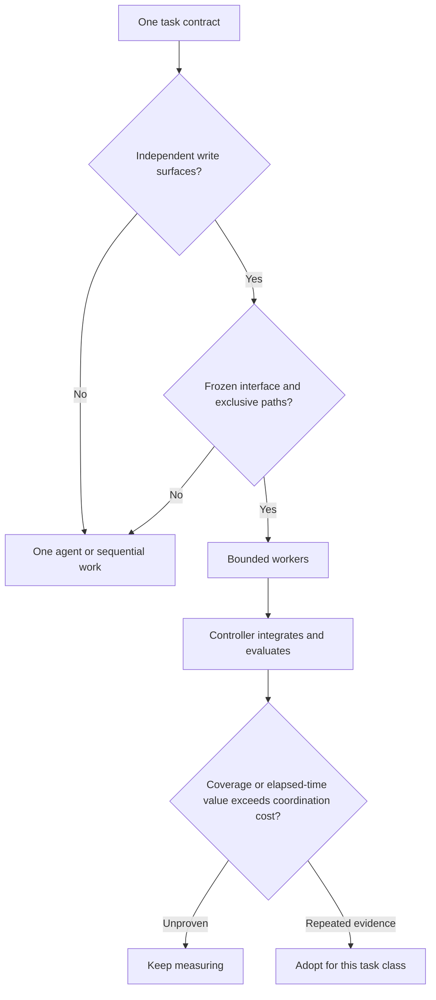

# When should Codex use multiple agents? A benchmark, not a slogan

More agents do not automatically produce better engineering. They usually add
total tokens, duplicated context, handoff delay, and integration risk. Their
defensible advantages are narrower: reduced elapsed time for independent work,
isolated investigation, or specialist evidence that one agent might omit.

The useful question is therefore not “Can this task use subagents?” It is:

> Does this task contain independent, bounded work whose value exceeds the
> coordination cost?

Codex How To now includes a dependency-free benchmark for testing that question
instead of answering it from intuition.

Disclosure: I maintain
[Codex How To](https://github.com/Phelan164/codex-howto), the independent
open-source project containing the benchmark, evaluator, and measurements used
here.

## The minimum decision rule

Use one agent when the change is small, the interface is unsettled, or several
steps must edit the same central files. Consider bounded orchestration only when
all of these are true:

1. The task has at least two genuine ownership surfaces.
2. Each writer can own exclusive paths.
3. The interface between those paths is frozen before implementation.
4. The controller retains integration, system checks, and final review.
5. Every worker returns concise evidence rather than a narrative transcript.
6. One external acceptance bar can evaluate every execution method.



Job titles are not ownership boundaries. “Backend agent,” “test agent,” and
“review agent” may still collide on the same files or execute dependent stages.
A useful boundary is concrete: one writer owns `incident/**`, another owns
`web/**`, and neither changes the shared contract.

## The benchmark task

The
[incident-response benchmark](https://github.com/Phelan164/codex-howto/tree/v0.6.0/labs/incident-response-benchmark)
asks Codex to build a small but cross-surface application with no third-party
dependencies:

- thread-safe JSON persistence with atomic replacement;
- validation, optimistic concurrency, and status transitions;
- an HTTP API and traversal-safe static serving;
- a responsive, accessible browser client;
- focused tests, integration checks, final review, and an evidence handoff.

The fixture has two deliberate implementation surfaces:

```text
incident/**  # persistence, validation, HTTP adapter
web/**       # HTML, CSS, browser behavior
```

Both the single-agent and orchestrated conditions start from the same commit,
task text, supplied tests, and frozen contract. The orchestrated condition may
use at most two implementation workers. The controller owns evaluation and the
final receipt.

Both conditions face the same external evaluator. It checks fixture integrity,
candidate scope, concurrent persistence, strict atomic writes, validation and
error mapping, live HTTP behavior, path traversal, static browser requirements,
and required handoff topics.

## What the first run actually showed

The first smoke run qualified the benchmark harness:

| Measure | Single agent | Controller + two workers |
|---|---:|---:|
| Accepted after review | Yes | Yes |
| Supplied tests | 4/4 | 4/4 |
| External evaluator groups | 6/6 | 6/6 |
| Edit conflicts | 0 | 0 |
| Integration rework | 0 | 0 |
| Internal review corrections | 1 | 0 |
| Browser interaction exercised by candidate | No | Yes |
| Aggregate tokens | Unavailable | Unavailable |
| Comparable elapsed time | No | No |

The orchestrated candidate returned live browser evidence covering creation,
filtering, state transitions, validation feedback, console errors, and a mobile
viewport. The single agent found and corrected a conflict-message behavior in
final review. An external controller later exercised its live HTTP behavior.

That result establishes feasibility, not superiority. The runs overlapped, the
environment did not expose aggregate controller-plus-worker tokens, and there
was only one candidate per method. It would be invalid to claim that
orchestration was faster, cheaper, or generally more reliable.

Read the complete
[smoke receipt](https://github.com/Phelan164/codex-howto/blob/v0.6.0/examples/measurements/incident-orchestration-smoke-2026-08-11.md)
before interpreting the table.

## A controller contract that limits fan-out

A large goal should not become permission to create an agent for every noun in
the prompt. Freeze the contract and state the maximum useful topology:

```text
Implement the incident-response task end to end.

Before delegation:
- freeze the HTTP and data contract;
- confirm that incident/** and web/** are independent write surfaces;
- keep evaluator and handoff ownership with the controller.

Delegation budget:
- at most two implementation workers;
- backend owns incident/** only;
- frontend owns web/** only;
- workers must not modify TASK.md, tests, evaluator files, or each other's paths.

Each worker returns:
- files changed;
- focused checks and outcomes;
- observable behavior exercised;
- failures, retries, and anything unverified.

The controller then runs supplied and external checks, exercises integration,
reviews the complete diff, fixes verified findings, and writes one receipt.
```

This contract does not force delegation. If the controller discovers that the
interface is unstable or the surfaces are coupled, the correct choice is a
single agent or sequential pipeline.

## Measure quality before speed

For each candidate, record raw facts before interpreting them:

| Dimension | Required evidence |
|---|---|
| Acceptance | Same evaluator and quality gates for every method |
| Coverage | Behavior exercised, failures found, and unverified behavior |
| Total cost | Controller plus every worker, including failed attempts |
| Elapsed time | Sequential, isolated runs on comparable machine load |
| Coordination | Worker count, handoff delay, duplicate investigation |
| Integration | Conflicts, contract mismatches, and rework events |
| Human effort | Corrections, retries, approvals, and manual intervention |

Do not substitute controller-only telemetry for total tokens. Do not remove
failed candidates. Do not compare overlapping runs as if they were isolated.
Write `unavailable` when the execution surface does not expose a metric.

Use one
[orchestration receipt](https://github.com/Phelan164/codex-howto/blob/v0.6.0/examples/templates/orchestration-run-receipt.md)
per candidate. Run at least three fresh sequential pairs and alternate which
method runs first. Compare acceptance and evidence completeness before elapsed
time or tokens.

## Where orchestration usually loses

Prefer one agent or a sequential workflow when:

- one clear agent can hold the relevant context;
- workers would edit the same files;
- one subtask depends on another's unresolved design;
- the task is primarily a single debugging chain;
- the evaluator cannot attribute failures to a candidate;
- per-agent cost is invisible and cost is the decision criterion; or
- the only justification is that parallelism is available.

For small bounded fixes, workflow guidance itself may cost more context than it
saves. Codex How To's earlier measurements found that the no-skill control was
the cheapest successful variant on a small backend defect, while a lean
engineering loop was cheapest on a medium browser-game task. Task class matters.

## Where orchestration may earn its cost

Good candidates include:

- independent modules with frozen interfaces;
- read-only review through independent security, reliability, and test lenses;
- noisy investigation that can be summarized before implementation;
- frontend and backend implementation after the API contract is fixed; and
- tasks where one specialist can add independently verifiable runtime evidence.

The benefit may be coverage rather than speed. If a specialist catches a real
defect or produces missing browser, deployment, or security evidence, higher
token use may still be rational. That is a quality decision, not a token-saving
claim.

## Replicate or falsify it

The next useful result is not another success screenshot. It is a controlled
pair that changes the recommendation:

1. Create identical disposable starting copies.
2. Keep model, reasoning effort, permissions, tools, task, time limit, and
   evaluator fixed.
3. Run one single-agent and one bounded-orchestration candidate sequentially.
4. Alternate order across at least three pairs.
5. Preserve failures and total controller-plus-worker telemetry.
6. Publish sanitized receipts and limitations.

Submit a result through the
[replication issue](https://github.com/Phelan164/codex-howto/issues/23) or add a
tested benchmark edition through a focused pull request. Negative and neutral
results are explicitly useful.

Codex How To is an independent community project. Official OpenAI documentation
remains authoritative for current product behavior.
